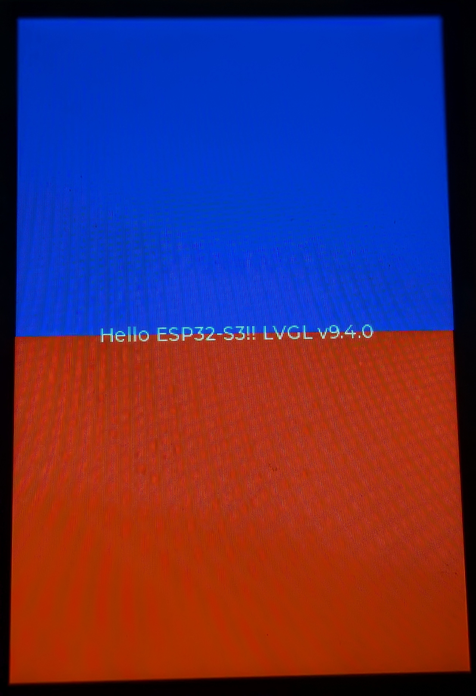

# Freenove FNK0104N Programs

MicroPython scripts for the [Freenove FNK0104N](https://store.freenove.com/products/fnk0104)
— an ESP32-S3 board with an onboard 3.5" 320x480 QSPI display (ST77922) that has an
integrated I2C capacitive touch controller.

Freenove only publish an Arduino/C++ tutorial for this board's display and touch. Everything
display- or touch-related in this repo is a from-scratch MicroPython port of their C++
source (see `st77922.py` and `st77922_touch.py` for exactly which Freenove files each one is
ported from), running on the community
[lvgl_micropython](https://github.com/lvgl-micropython/lvgl_micropython) project instead of
stock MicroPython.



## Hardware

- Board: ESP32-S3-WROOM N8R8 (8MB flash, Octal PSRAM)
- Display: ST77922, 320x480, QSPI, portrait native orientation
- Touch: integrated capacitive controller on the display panel, but wired as its own,
  separate I2C peripheral (not exposed through the display's QSPI commands)
- Onboard extras: WS2812 (NeoPixel) RGB LED on GPIO 40, plain LED on GPIO 45
- SD card (microSD, SDMMC 4-bit) and an ES8311 audio codec + speaker amp, for `music_player.py`

### Pin reference

| Function | Pins |
|---|---|
| Display (QSPI, SPI2_HOST @ 80MHz, mode 0) | `CS=10 BL=41(GPIO) SCLK=12 D0=11 D1=13 D2=14 D3=9` |
| Touch (I2C, addr `0x55`, 16-bit register addresses) | `SCL=39 SDA=38 RST=48 INT=47` |
| SD card (SDMMC, 4-bit)* | `CLK=5 CMD=4 D0=6 D1=7 D2=2 D3=3` |
| Audio: I2S to ES8311 DIN* | `BCK=18 WS=21 SD=15` (MCK=17 exists but is unused -- see `es8311.py`) |
| Audio: ES8311 control (I2C, addr `0x18`)* | `SCL=39 SDA=38` (shares the touch controller's bus) |
| Audio: speaker amp enable* | `GPIO 1` (active-LOW -- confirmed on hardware; docs.freenove.com didn't document polarity) |
| Onboard RGB LED (WS2812) | `GPIO 40` |
| Onboard LED | `GPIO 45` |

\* SD card and audio pins are FNK0104N-specific values sourced from docs.freenove.com (see
`music_player.py`'s docstring for the exact chapter URLs) rather than from a Freenove source
file the way the display/touch pins were. Confirmed working on hardware; the one value
docs.freenove.com got wrong was the amp-enable pin's polarity (see `music_player.py`).

## Why a custom firmware is required

Stock MicroPython has no `lvgl` or `lcd_bus` modules. Scripts that touch the display
(`hello_world_display.py` and anything importing `st77922`/`st77922_touch`) require the
custom `lvgl_micropython` firmware built for this project — see **Firmware** below.
`led_blink.py`, `rgb_led_blink_fnk0104n.py`, and `music_player.py` (with `es8311.py`/
`wavplayer.py`) don't need it — they only use `machine.I2C`/`I2S`/`SDCard`/`Pin` and will run
on stock MicroPython too.

## Files

| File | Description |
|---|---|
| `hello_world_display.py` | Main display/touch demo. Shows a red-top/blue-bottom split screen; tapping either half toggles it between red and blue. |
| `touch_led_colors.py` | Divides the screen into 5 touch areas (red/green/blue/white/black); tapping one sets the onboard RGB LED to that color. |
| `music_player.py` | Plays a WAV file from the SD card over the onboard ES8311 codec/speaker; currently plays `demo1.wav` on run. Confirmed working end-to-end on hardware. Starting point for a future full SD-card music player. |
| `es8311.py` | I2C driver for the ES8311 audio DAC/codec (playback only), ported from raptor09010's `Micropython-ES8311-Library`. |
| `wavplayer.py` | Non-blocking WAV-over-I2S player, from Mike Teachman's `micropython-i2s-examples` (via the same ES8311 library repo above). |
| `mp3_to_wav.py` | **PC-side tool**, not a board script. Converts an MP3 to a 16-bit PCM WAV (this firmware has no MP3 decoder) using `miniaudio`; run with the project's `.venv`. |
| `demo1.mp3` / `demo1.wav` | Sample track. The `.wav` (produced by `mp3_to_wav.py`) is what actually gets copied to the SD card and played. |
| `screenshot.jpg` | Photo of `hello_world_display.py` running on the board. |
| `st77922.py` / `_st77922_init.py` | ST77922 QSPI display driver, ported from Freenove's `ST77922.h`/`.cpp`. `_st77922_init.py` holds the panel init command table. |
| `st77922_touch.py` | I2C driver for the display's integrated touch controller, ported from Freenove's `ST77922_Touch.h`/`.cpp`. |
| `led_blink.py` | Blinks the plain onboard LED (GPIO 45). No firmware/display dependency. |
| `rgb_led_blink_fnk0104n.py` | Cycles the onboard WS2812 RGB LED (GPIO 40) through red/green/blue. No firmware/display dependency. |
| `firmware/lvgl_micropy_ESP32_GENERIC_S3-SPIRAM_OCT-8.bin` | The custom-built firmware binary (see below). |

None of these scripts auto-run on boot — there's no `main.py`/`boot.py`. Run them manually
from the REPL (`import hello_world_display`, etc.).

`music_player.py` also needs `demo1.wav` copied to the root of a microSD card inserted in the
board (fastest via a card reader, not WebREPL/serial — it's ~4.7MB), and `es8311.py` /
`wavplayer.py` pushed alongside it like any other loose file.

`st77922_touch.py` was also verified against Sitronix's own register-level protocol spec for
the touch controller (pulled from Freenove's GitHub repo's `Datasheet/` folder), kept locally
as `Datasheet/ST77922_TDDI_Interface_Protocol_V01.00.pdf` but **not committed to this repo**
— it's marked confidential by Sitronix, so `.gitignore` excludes it.

## Firmware

Built from a clone of `lvgl_micropython` (WSL Ubuntu), with:

```
python3 make.py esp32 BOARD=ESP32_GENERIC_S3 BOARD_VARIANT=SPIRAM_OCT DISPLAY=st77922
```

Flash `firmware/lvgl_micropy_ESP32_GENERIC_S3-SPIRAM_OCT-8.bin` with `esptool` at 460800
baud. The board has no auto-reset circuitry on its native USB port, so flashing needs manual
BOOT+RESET into download mode — and it enumerates on a *different* COM port in bootloader
mode vs. running firmware.

`st77922.py`, `_st77922_init.py`, and `st77922_touch.py` are plain files on the board's
filesystem, not frozen into the firmware binary — MicroPython loads the filesystem copy over
any same-named module frozen into firmware, so iterating on them is just a matter of editing
here and re-pushing (e.g. via `mpremote cp <file> :`) — no firmware rebuild needed. A
rebuild is only required to change something genuinely baked into firmware (board config,
frozen framework modules, etc).

## Known limitations

- **No MP3 decoding on-device.** This firmware has no MP3 decoder (MicroPython/ESP32 doesn't
  ship one, and this project's build doesn't bundle one). `mp3_to_wav.py` decodes MP3s to WAV
  on the PC instead; real on-device MP3 decoding would need a native C decoder (e.g.
  libhelix-mp3) added to the firmware build.
- **Landscape/rotation is not implemented.** Freenove's own driver does a manual software
  pixel-shuffle for rotation 1/3 because hardware MADCTL rotation doesn't behave correctly on
  this panel; `st77922.py` only implements rotation 0 (native portrait).
- **Multi-touch is not implemented.** The touch controller reports multiple contact points,
  but `st77922_touch.py` only reads and uses the first one (sufficient for single-touch
  tap/click use, which is all `hello_world_display.py` needs).
- **Hard-reset the board (physical RESET button / power-cycle) after any script run that
  raises an exception or is interrupted before finishing**, not just after editing code. The
  display's QSPI bus and `esp_lcd` panel-IO handle are native ESP-IDF resources that aren't
  freed by a soft-reset/re-run alone — an aborted run can leave enough of the board's small
  internal (non-PSRAM) DMA-capable memory pool allocated that the *next* run's display init
  fails with `ESP_ERR_NO_MEM` even though the code itself is fine.
